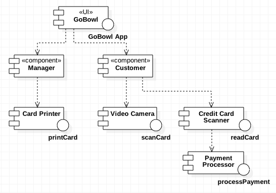
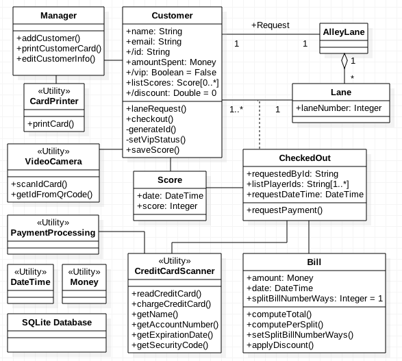
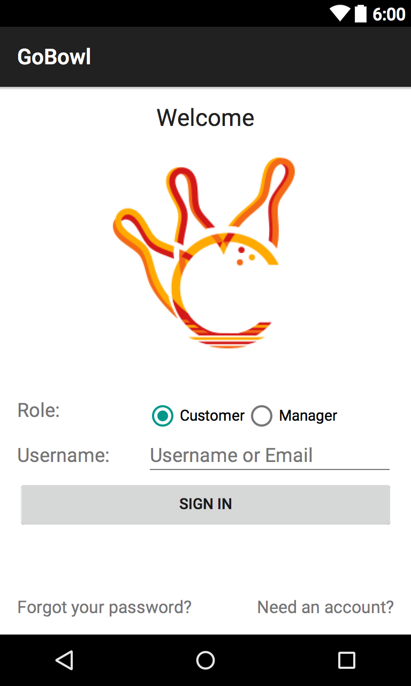
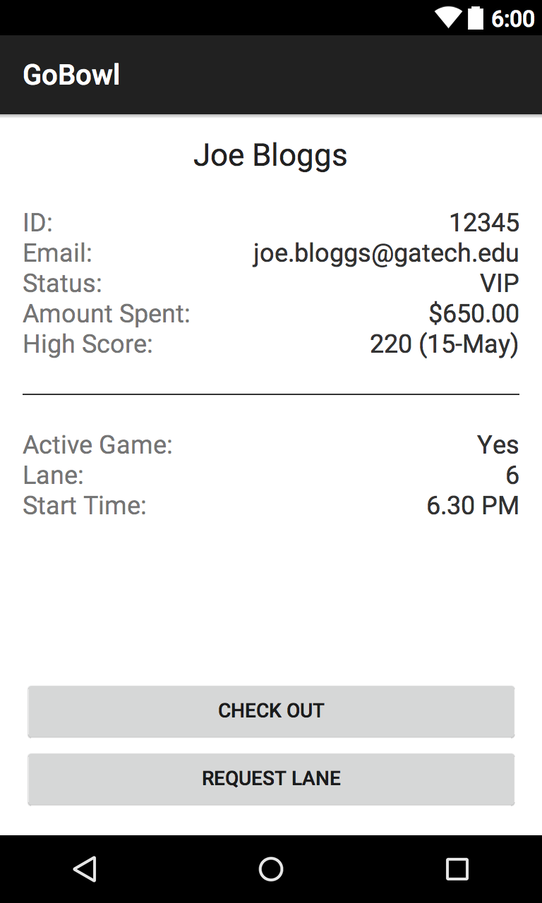
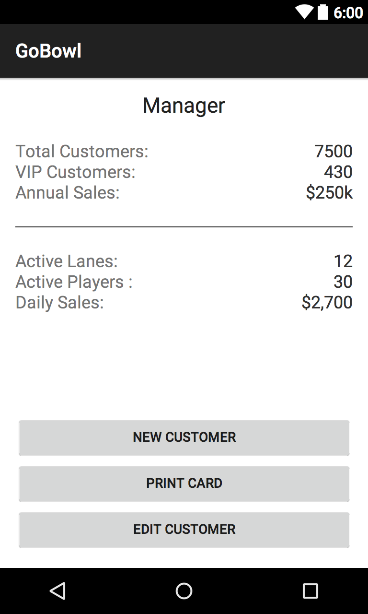

# Design Document

This document outlines the application design, architecture, and user interface.

**Author**: Team 30  
**Current Version**: V1

| *Version* | *Description*       |
| ----------|:-------------------:|
| *V1*      | *Deliverable 2*     |

## 1. Design Considerations

### 1.1. Assumptions

  * The owners of the bowling alley (Harry and Sally) will purchase all external hardware and utilities software that is required and it will be supported on the Android platform.
  * The owners of the bowling alley (Harry and Sally) will provide the Android enabled devices.
  * A simple data persistence layer inside the device will be assumed ahead of a more permanent external database solution can be created for the bowling alley.
  * The app will provide a login screen that will route customers and managers to separate layouts; username and password authentication is currently out of scope.

### 1.2. Constraints

  * The system needs to support two different types of users: customer and manager. These two user types have very different use cases that must be implemented as well as requiring distinct application interfaces.
  * A data persistence layer must be implemented so that users can be tracked across time and their state is saved when the application is not directly running on a device.
  * The device needs to interface with a number of external hardware systems and will require driver plugins / APIs for all required utilities.

### 1.3. System Environment

###### *Run Time Environment and Hardware:*
  * The software must run on the Android Operating System
    * The application will support a minimum SDK of API 15 4.0.3 (IceCreamSandwich)
  * The system must operate on Android supported phones and tablets
    * Wearables (including smart watches), TV, Android Auto, Glass, etc are all currently out of scope

###### *External System Dependencies (Android Utilities):*
  * Video Camera - *scan customer cards (QR codes)*
  * Card Printer
  * Credit Card Scanner
  * Payment Processor

## 2. Architectural Design

### 2.1. Component Diagram

The GoBowl application itself is only a single component, however, it lives within and is the center or the larger bowling alley system. This system also has a number of various utilities which support producing customer ID cards, scanning customer ID cards, and credit card payment processing.

### 2.2. Deployment Diagram

A deployment diagram is not required for the GoBowl application as Android provides the full software stack (OS, middleware and runtime environment).

Leveraging the Android SDK tool suite (Android Studio), the GoBowl application will be compiled and packaged as an Android application archive file (.apk) which can then be deployed to an Android enabled device.

## 3. Low-Level Design

### 3.1. Class Diagram

The system follows an OO design based on the following UML class diagram:

### 3.2. Other Diagrams

No additional diagrams.

## 4. User Interface Design

The GoBowl app will be divided among three main layouts: login, customer, and manager.

##### *Login*
The login screen routes customers and managers to separate screens. User authentication is currently out of scope.

##### *Customer*
The customer UI provides the customer's details, information on any currently active games, as well as the uses cases through buttons.

##### *Manager*
The manager UI provides the three main use cases as buttons. Statistics for the manager class are currently out of scope and shown for purpose of design prototyping.

