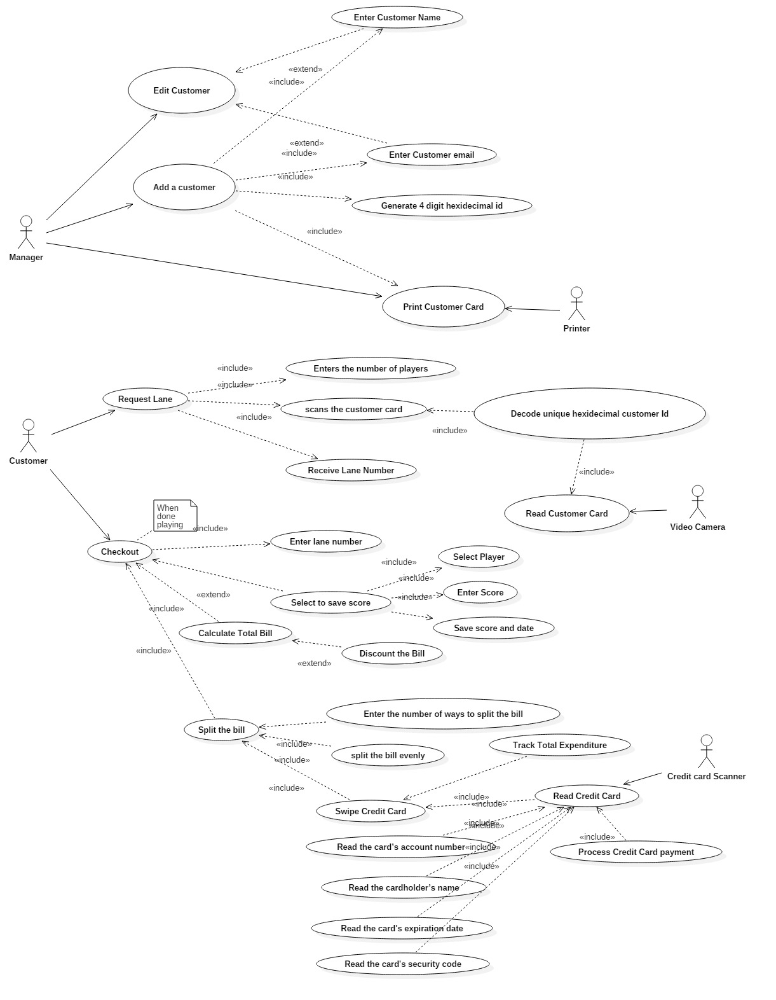

# Use Case Model

This document provides the use case diagram and corresponding use case descriptions.

**Author**: Team 30  
**Current Version**: V1

| *Version* | *Description*       |
| ----------|:-------------------:|
| *V1*      | *Deliverable 2*     |

## 1. Use Case Diagram

## 2. Use Case Descriptions

*For each use case in the use case diagram, this section should contain a description, with the following elements:*

- *Requirements: High-level description of what the use case must allow the user to do.*
- *Pre-conditions: Conditions that must be true before the use case is run.*
- *Post-conditions Conditions that must be true once the use case is run.*
- *Scenarios: Sequence of events that characterize the use case. This part may include multiple scenarios, for normal, alternate, and exceptional event sequences. These scenarios may be expressed as a list of steps in natural language or as sequence diagrams.*

##### Actor: *Manager*
* **UC1. Add Customers**
  * _Requirements:_ The system shall allow the manager to add a customer in order to for the customer to request a lane.
  * _Pre-Conditions:_ The application must be installed on the manager's phone.
  * _Post-conditions:_ The name and e-mail of the customer have been captured  and the system has assigned a unique hexadecimal ID to the customer.
  * _Scenarios:_
    * _Normal:_
      1. The manager enters the customer's name.
      * The manager enters the customer's e-mail.
      * The manager submits the information.
      * The system creates a unique hexadecimal ID for the customer
      * Creates the customer and stores the information provided.
    * _Exception:_
      1. The manager enters a non conforming e-mail and submits.
      * The system empties the text field and returns to the screen.
* **UC3. Edit Customer**
  * _Requirements:_ The system shall allow the manager to edit customer information.
  * _Pre-Conditions:_ The manager has the application installed on his phone and the customer exists.
  * _Post-conditions:_ The customers e-mail or name are changed.
  * _Scenarios:_
    * _normal:_
      1. The manager searches for the customer by e-mail.
      2. Selects the customer.
      3. Selects to modify the customer e-mail or name.
      4. Changes the e-mail or name.
      5. Submits the changes.
* **UC4. Edit Customer Name**
  * _Requirements:_ The system shall allow the manager to enter a new customer name.
  * _Pre-Conditions:_ UC1 or UC3 are being executed.
  * _Post-conditions:_ The customer name is updated.
  * _Scenarios:_
      * _normal:_
          1. the manager enters the name.
* **UC5. Edit Customer email**
  * _Requirements:_ The system shall allow the manager to enter a new customer e-mail.
  * _Pre-Conditions:_ UC1 or UC3 are being executed.
  * _Post-conditions:_ The customer e-mail is updated.
  * _Scenarios:_
    * _normal:_
        1. the manager enters the email.
        2. system checks the entry.
          1. if valid e-mail format accept
          2. if invalid e-mail notify the manager and empty the entry without saving
* **UC6. Generate 4 digit hexidecimal id**
  * _Requirements:_ The system shall generate a unique 4 digit hexidecimal customer id.
  * _Pre-Conditions:_ The customer does not exist and UC1 is executed.
  * _Post-conditions:_ The customer has a unique hexidecimal 4-digit id.
  * _Scenarios:_
    * _normal:_
      1. System reads the last customer id
      2. increments by 1
      3. converts to hex
##### Actor: *Printer*
* **UC2. Print Customer Card**
  * _Requirements:_ The system shall print the customer's card in order for the customer to be able to request a lane.
  * _Pre-Conditions:_ The manager has the application installed on his phone and the customer exists.
  * _Post-conditions:_ The printer has printed on card the QR encoding of the customer's hexadecimal unique ID.
  * _Scenarios:_
    * _normal:_
      1. The manager searches for the customer by e-mail.
      2. Selects the customer.
      3. Request a print of the customer's card.
      4. The printer prints the card.
    * _Excepton:_
      1. The printer fails to print. The process is repeated.
##### Actor: *Customer*
* **UC7. Request Lane**
  * _Requirements:_ The system shall allow the customer to request a lane.
  * _Pre-Conditions:_ The application must be installed on the customer's phone.
  * _Post-conditions:_ The customer receives a lane.
  * _Scenarios:_ The customer selects to request a lane.
* **UC8. Checkout**
  * _Requirements:_ The system shall allow the customer to checkout.
  * _Pre-Conditions:_ The application must be installed on the customer's phone and a lane is assigned to the customer.
  * _Post-conditions:_ The customer releases the lane and pays his bill.
  * _Scenarios:_ The customer selects to check out a lane.
* **UC9. Enter Number of players**
  * _Requirements:_  The system shall allow the customer to enter number of players in the lane.
  * _Pre-Conditions:_ The application must be installed on the customer's phone and the customer has initiate a lane request.
  * _Post-conditions:_ The system captures how many people will be playing on the lane.
  * _Scenarios:_ The system prompts the customer for the number of players on the lane. The customer enters an integer larger than 0. If other digits are entered, the system empties the text field and requests again.
* **UC10. scans the customer card**
  * _Requirements:_  The system shall scan the customer's card.
  * _Pre-Conditions:_  The customer has a card.
  * _Post-conditions:_ The system verifies the players are registered and knows in which lane each customer plays.
  * _Scenarios:_ The system prompts the customers to scan their cards. Each customer scans their card. After the card is read and the customer is verified as register. The system asks for the next customers card. This continues until the entered number of players is reached. If a card does not correspond to a registered customer the application will continue to wait for the next card to be scanned. The customer can terminate the process before all customers scan their cards. IN this case, the system will adjust the number of players in the lane to the number of successfully scanned cards.
* **UC11. Receive Lane Number**
  * _Requirements:_ The system shall provide the customer with a lane number.
  * _Pre-Conditions:_  The application must be installed on the customer's phone and the customer has initiate a lane request. All player cards have been scanned.
  * _Post-conditions:_ The system provides a lane number to the customer.
  * _Scenarios:_ The system finds the next open lane and assigns it to the customer and his players. The lane number is shown to the customer.
* **UC14. Enter Lane Number**
  * _Requirements:_ The system shall allow the customer to enter the lane number from which they are checking out.
  * _Pre-Conditions:_ The application must be installed on the customer's phone and the customer was assigned a lane request. The customer is checking out.
  * _Post-conditions:_ The system identifies which lane to check out.
  * _Scenarios:_ After initiating, check out the system prompts the customer for their lane number. The customer enters the lane number. If the lane number does not correspond to a lane requested by the customer, the system will continue to prompt the customer.  
* **UC15. Select Save Score**
  * _Requirements:_ The system shall allow the customer to save their score.
  * _Pre-Conditions:_ The application must be installed on the customer's phone and the customer was assigned a lane request. The customer is checking out.
  * _Post-conditions:_ The system is informed to store a player scores.
  * _Scenarios:_ The system prompts the user if they want to save player scores.
* **UC16. Select Player**
  * _Requirements:_ The system shall allow the customer to select a player.
  * _Pre-Conditions:_ The application must be installed on the customer's phone and the customer was assigned a lane request. The customer is checking out. The customer elected to save the score.
  * _Post-conditions:_ The customer whose score is to be saved has be selected.
  * _Scenarios:_ The list of customers playing in the lane presented to the customer. The customer selects the player.
* **UC17. Enter Score**
  * _Requirements:_ The system shall allow the customer to enter the score of a player.
  * _Pre-Conditions:_ The application must be installed on the customer's phone and the customer was assigned a lane request. The customer is checking out. The customer elected to save the score.
  * _Post-conditions:_ The player score is captured by the system.
  * _Scenarios:_ Once the customer has selected the player whose score is to saved, they are prompted for the score. The customer enters an integer from 0 to 200.
* **UC18. Save score and date**
  * _Requirements:_ The system shall allow the customer to save the score and date it was scored.
  * _Pre-Conditions:_ The application must be installed on the customer's phone and the customer was assigned a lane request. The customer is checking out. The customer elected to save the score.
  * _Post-conditions:_ The selected player's score is saved.
  * _Scenarios:_ Once the score is entered, the system captures the date and score and saves them in the selected customer's history.
* **UC20. Calculate Total Bill**
  * _Requirements:_ The system shall calculate the total bill of customer for a lane.
  * _Pre-Conditions:_ The application must be installed on the customer's phone and the customer was assigned a lane request. The customer is checking out. The bill has been calculated.
  * _Post-conditions:_ The system produces the total amount owned for using the lane.
  * _Scenarios:_ The system reads the price table. Selects the appropriate rate. The system multiplies the rate, by the time the lane was occupied and customers in the lane.
* **UC21. Discount the Bill**
  * _Requirements:_ The system shall discount the total bill of a customer by 10%, if they are a VIP.
  * _Pre-Conditions:_ The application must be installed on the customer's phone and the customer was assigned a lane request. The customer is checking out. The bill has been calculated.
  * _Post-conditions:_ The system produces the discounted the total amount owned.
  * _Scenarios:_  The system determines if the Customer was a VIP last year. If yes, it applies a 10% discount on the total amount. If the customer was not VIP, no discount is applied.
* **UC23. Split the bill**
  * _Requirements:_ The systems shall allow the customers to split the bill.
  * _Pre-Conditions:_ The application must be installed on the customer's phone and the customer was assigned a lane request. The customer is checking out. The bill has been calculated.
  * _Post-conditions:_ The customer decides to pay the bill.
  * _Scenarios:_ The system prompts the user to pay the bill and customer proceeds. UC24-26 cover the detailed steps.
* **UC24. Enter the number of ways to split the bill**
  * _Requirements:_ The system shall allow the customers to specify the number of ways the bill will be split.
  * _Pre-Conditions:_ The application must be installed on the customer's phone and the customer was assigned a lane request. The customer is checking out. The bill has been calculated.
  * _Post-conditions:_ The number of requested separate bills is requested.
  * _Scenarios:_ The system reads how many customers played in the lane. Then allows the customer who requested the lane to select a number between and the number of customers who played in the lane.
* **UC25. Split the Bill evenly**
  * _Requirements:_ The system shall split the bill in the specified number of ways.
  * _Pre-Conditions:_ The application must be installed on the customer's phone and the customer was assigned a lane request. The customer is checking out. The bill has been calculated. The customer elected to split the bill.
  * _Post-conditions:_ The bill amount is divided by the number of separate bills requested.
  * _Scenarios:_ The total bill amount is divided by number of separate bills requested.
* **UC26. Swipe Credit Card**
  * _Requirements:_ The system shall asked customers to swipe their credit cards.
  * _Pre-Conditions:_  The application must be installed on the customer's phone and the customer was assigned a lane request. The customer is checking out. The customer has a card.
  * _Post-conditions:_ The customer knows to swipe their card.
  * _Scenarios:_ The system requests the customer to scan their card.
  * **UC22. Track Total Expenditure**
    * _Requirements:_ The system shall track the amount a customer spent during a calendar year.
    * _Pre-Conditions:_ The application must be installed on the customer's phone and the customer was assigned a lane request. The customer is checking out. The total bill has been calculated and discounted and payment made.
    * _Post-conditions:_ The amount spent by the customer is added to his previous spend.
    * _Scenarios:_ After payment is made, The current paid amount is applied to the running total of the customer's spend in the bowling alley. If it exceeds $500 dollars the customer is flaged as VIP.

##### Actor: *Video Camera*  
  * **UC12. Decode hexidecimal customer id**
    * _Requirements:_ The system shall decode the QR code to the 4 digit hexidecimal customer id.
    * _Pre-Conditions:_ The customer has a printed card and it was read.
    * _Post-conditions:_ The customer's unique hexidecimal id is read.
    * _Scenarios:_ The digitized QR code is decoded to a 4 digit hexidecimal code.
  * **UC13. Read Customer Card**
    * _Requirements:_   The system shall read the customer's card.
    * _Pre-Conditions:_  The customer has a printed card.
    * _Post-conditions:_ The QR Code on the customer's printed card is digitized.
    * _Scenarios:_ The customer place their printed card in front of the Video Cammers. The video camera recognized the pictogram and digitizes it. If the pictogram cannot be read, the scanner beeps and continue to try to scan the card.

##### Actor: *Credit card Scanner*  
* **UC27. Read Credit Card**
  * _Requirements:_ The system shall read the customer's credit card.
  * _Pre-Conditions:_ The customer has a credit card.
  * _Post-conditions:_ The credit card information is read from the card.
  * _Scenarios:_ The scanner reads the credit card information from the credit card.
* **UC28. Process Credit Card Payment**
  * _Requirements:_ The system shall process the customer credit card.
  * _Pre-Conditions:_ The credit card was scanned.
  * _Post-conditions:_ The customer is charged.
  * _Scenarios:_ The scanner reads the card, transmites the information to the payment information to the credit institution. The system will inform the card reader if the payment went throw and the funds transfered to the manager. If not the card is rejected and the manager notified.
* **UC29. Read the card's account number**
  * _Requirements:_ The credit card scanner shall read the credit card's number.
  * _Pre-Conditions:_ The credit card was scanned.
  * _Post-conditions:_ The credit card number is read.
  * _Scenarios:_ The scanner reads the card and decodes the information.
* **UC30. Read the cardholder's name**
  * _Requirements:_ The credit card scanner shall read the credit card's name.
  * _Pre-Conditions:_ The credit card was scanned.
  * _Post-conditions:_ The cardholder name is read.
  * _Scenarios:_ The scanner reads the card and decodes the information.
* **UC31. Read the card's expiration date**
  * _Requirements:_  The credit card scanner shall read the credit card's expiration date.
  * _Pre-Conditions:_ The credit card was scanned.
  * _Post-conditions:_ The card's expiration date is read.
  * _Scenarios:_ The scanner reads the card and decodes the information.
* **UC32. Read the card's security code**
  * _Requirements:_  The credit card scanner shall read the credit card's security code.
  * _Pre-Conditions:_ The credit card was scanned.
  * _Post-conditions:_ The card's security code is read.
  * _Scenarios:_  The scanner reads the card and decodes the information.
