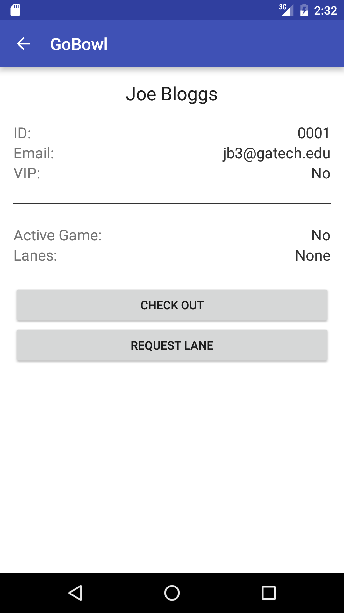
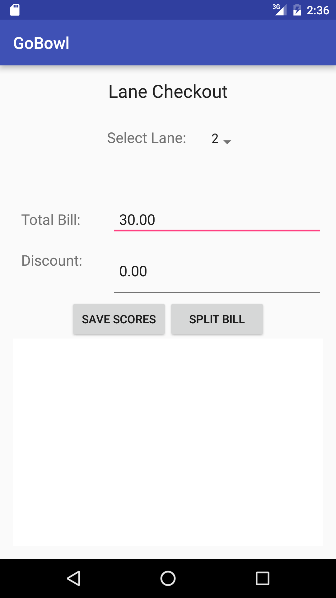
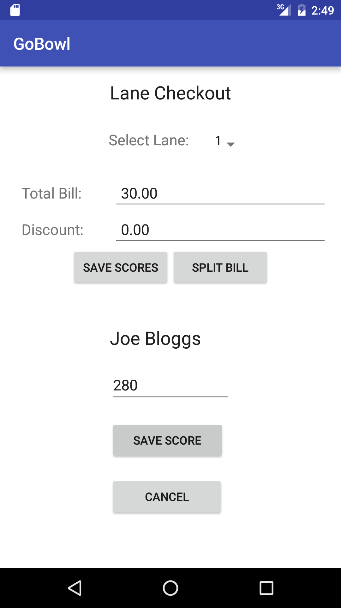

# User Manual

User manual for GoBowl Android application.

**Author**: Team 30  
**Current Version**: V2

| *Version* | *Description*       |
| ----------|:-------------------:|
| *V1*      | *Deliverable 3*     |
| *V2*      | *Deliverable 4*     |

# 1. Login
When you first launch the GoBowl application, you will be greeted with the login screen that will prompt you to sign in as either a Customer or Manager.

#### Customer
When signing in as the customer, you will need to enter a registered email address so the system can validate your account. As an existing customer and forgot your registered email address or are a new customer and need an account, press the corresponding buttons at the bottom of the screen for instructions. Once you have a valid email address entered, simply press the sign in button and you will be redirected to the main customer screen.

#### Manager
When logging in as the manager you simply need to toggle the radio button over to Manager (no Email required because there is only a single manager). Simply press sign in button and you will be redirected to the main manager page.

# 2. Manager

The main manager screen presents a high level view of the GoBowl customers as well as the bowling alley lanes.

From this screen you can perform the following actions:

#### New Customer
Add a new customer to the system. Enter the new customer's first name, last name, and email address and they will be registered into the system. This automatically generates an ID and prints a card. A message will appear on the screen after submitting confirming both the creation of the customer as well as the card printing. If the card printer fails for any reason or you simply want to print another card, press the print card button.

#### Print Card
Select a Customer from the drop down and press submit. A message will appear on the screen either confirming success of printing or a failure. If the printer fails you can always try again. Note that card will be printed automatically when a customer is created.

#### Edit Customer
Select a customer from the drop down list and edit their information directly. Simply press submit when you are done with the changes and they will be updated in the system. Press Cancel at any time if you change your mind. A new card will not be printed after editing, if required please use the Print Card button for the newly updated customer.

#### Delete Customer
Select one or many customers from checkbox dialog that pops up on the screen after pressing the delete customer button. Press submit to delete the selected customers or cancel at any time if you change your mind. Warning, all deletions are final; you will need to create a new customer if you accidentally deleted one.

#### Show All Customers
Simply brings up a scrollable list of all customers in the system. Click the back button to exit the screen.

#### Delete All Customers
Allows the manager to clear all customers and lane activity from the database. This can be used to effectively reset the system.

# 3. Customer

The main customer screen after logging in greats the user with details on their account and the ability to either request a lane (ie start bowling) or checkout from an existing game.

#### Request Lane
Request a bowling lane to play a game. Press "Request Lane" then select the number of players that will be playing on the lane (up to 8 for a lane). Please note that you will not be able to request lanes for up to 8 individuals if their is an insufficient customer base (eg if there is only one customer in the system you cannot request 2 players).

Press the "Submit" button when finished entering the number of players. The system will ask to scan each player's card one at a time. Put card on scanner and select "Scan Card". Player cannot already be playing a game on a different lane. Once all players have scanned their cards the lane will be requested.

#### Checkout

User will reach the Checkout when Checkout button is pressed on the Checkout screen.

If the customer has not requested a lane a message is displayed informing them. Otherwise, the application transitions to the checkout screen.

The spinner at the top allows the customer to select which of the lanes s/he has requested to calculate the total for. The customer does not have to press an extra button. The total is calculated automatically and displayed. If the customer is a VIP, the total displayed is the discounted total and the discount field informs them of the discount. Adding the discount and total gives the  total without the discount. Another important point here is that application will not work for games which last across days. So all customers need to check out at the end of the day.

The save scores button allows the customer to save the scores of the players in the lane:

The application cycles through the customers. The customer adds the score and presses "save score". The application stores the score along with a time and date for the specific player. If the customer chooses "cancel" at any given time, the application will exit the save score mode and not proceed further. Pressing the save scores button again will add another set of scores, so beware.

The split bill button takes the customer to the split bill screen description in the next section.

#### Split Bill
To access Split Bill, press "Split Bill" below "Calculate Bill". Instantly you will be directed to Split Bill, there you will find today's date displayed and many other components that may or may not need the user's input. Below is a break down of each component.

Today's Total:

  * Total is displayed once "Split Bill" renders. This total is retrieved from checkout. To see more view, Checkout.

Enter Number of ways to split bill:

  * Here the user has the option to enter the number of ways to split bill
  * Enter a number greater than zero

Even Split:

  * Here the user can view the total split based on the "number of ways to split" the user entered.
  * To view the split see "Split Button"

Split Button

  * When the user press "Split" button the split will display next to "Even Split"
  * Note: Again "number of split" that the user enters must be greater than zero.

Swipe Card Button

  * When the user press "Swipe Card" button the user will be directed to swipe their card.
  * The credit details for each split portion of the bill will be scanned automatically and sent to the payment processor.
  * Once the card is scanned and the payment is processed the app will return to the main login screen.
