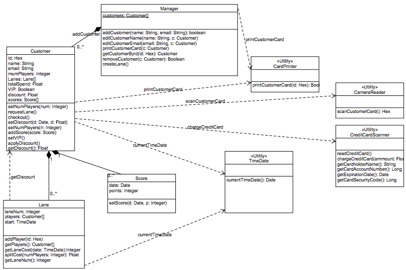
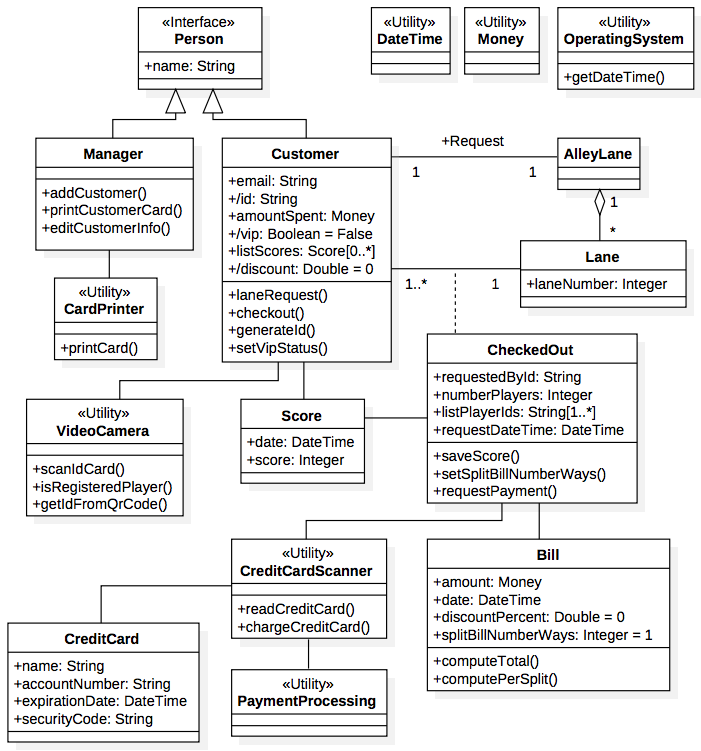
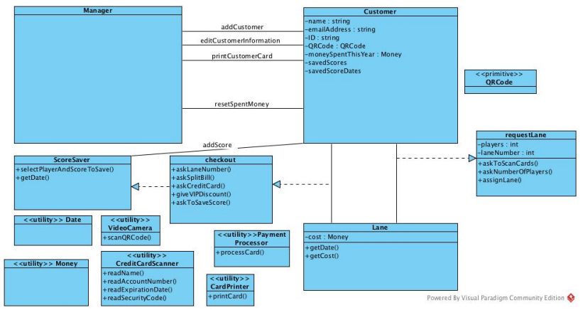
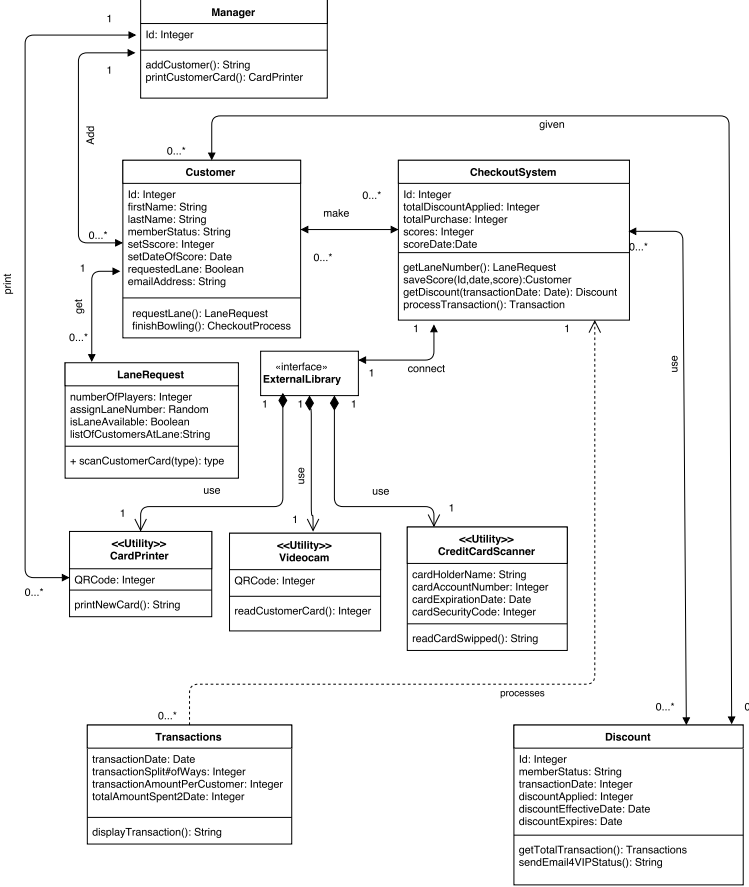
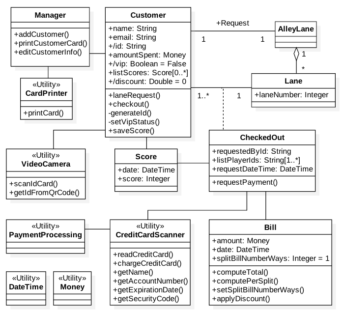

# Team 30 - Deliverable 1: GoBowl Design
Design specification for GoBowl, a bowling alley management system that runs on the Android platform.

## Individual Designs
This section reviews each team members individual designs and discusses the pros and cons of their individual approaches as they emerged during team discussions.

#### Design 1 - *Nicholas Athanasiades*

##### *Pros -*
  * Relationships between classes is well documented with lots of attributes and operations
  * The diagram is fairly tight in terms of the number of classes and leverages operations rather than additional auxiliary classes to model actions in the system
  * Well connected relationship with utility classes

##### *Cons -*
  * The customer class is overloaded with the attributes of the checkout process which can be split out into an association class
    * For example, the number of players is an attribute of the checked out lane relationship and not a native attribute of a customer
  * Need a bill or transaction class to model the payment for the lane
  * Extra methods are included which do not need to be explicitly modeled based on the requirements

#### Design 2 - *Gustave Bartuska*

##### *Pros -*
  * The association class represents the relationship well between the Lane and the Customer
  * Bill class well represents money and payment aspects of a Customer having a CheckedOut Lane
  * Model is concise in terms of the classes, attribute, and operations

##### *Cons -*
  * Can move the getDateTime method to DateTime utility class as its likely already provided there
  * Subclassing is a good practice but Person doesn't need to be an Interface and might be unnecessary in general
  * Do not need to model CreditCard as a separate class, can simply run through the CreditCardScanner and PaymentProcessing Utility classes
  * Could explicitly model the relationships between Utility classes and the rest of the model components

#### Design 3 - *Jake Fund*

##### *Pros -*
  * Modeling the relationship between the Customer and Lane classes as association classes rather than as attributes to the Classes makes things clear
  * Succinct model and use of Utility classes

##### *Cons -*
  * Manager class should house some of the modeled associations as direct class attributes
    * Classes in general should have a section for attributes and operations
    * Utility classes should be connected to the rest of the Model
  * QRPrime primitive class is not needed (code gets translated into ID anyways when read)

#### Design 4 - *Amanda Wright*

##### *Pros -*
  * Good split out of the Transaction and Discount since those are features of the Checkout relationship
  * Very high level of detail modeled with the relationships all explicitly shown

##### *Cons -*
  * LaneRequest is probably best modeled as an association class between the Customer class and a physical Lane
  * CheckedoutSystem class contains features of both the relationship between nouns as well as other class attributes
  * ExternalLibrary Interface attempts to provide abstraction for Utility classes but may not be necessary or practical in terms of implementation

## Team Design
This section presents the single team design that was created following review of each individual design.

##### *Main Commonalities and Differences to Individual Models -*
  * We were all aligned in terms of the basic structure of the Manager and Customer classes but we all included fairly different attributes and operations beyond a core set
  * Individual designs modeled transaction cost, or Bill, as part of the Lane or the Customer class
  * The highest degree of modeling variability was around the requesting and checking out of lanes
  * We all followed slightly different levels of granularity in terms of the number and detail of associations to represent in the model
  * There are a significant number of Utility classes that we all modeled similarly

##### *Main Design Decisions -*
  * Use of an association class to model the relationship between Customer and Lane
  * Splitting out of the Transaction and Bill details into a separate class
  * Using AlleyLane to model the customer's desire to checkout any Lane rather a particular one
  * Avoid overloading specific classes by distributing functional responsibilities across additional classes
  * Reduced the use of Utility classes to those the system would have a direct dependency on
    * In this respect, no assumptions or undue restrictions are made about supporting APIs or systems

##### *Implementation Considerations -*  
  * Bill discount is stored as an attribute of the Customer but applied to the Bill through the applyDiscount method
    * the discount is Customer specific and applied to the entire Bill
  * While CheckedOut and Bill are closely linked, all items related to the cost of checking out a lane are encapsulated in the Bill class
  * Score is modeled as a separate class and decoupled from the checkout association class
  * The number of players on a checked-out lane is captured via the length of listPlayerIds
  * The QRCode is an encoding and does not need to be modeled explicitly as it is translated into the Customer ID by the VideoCamera utility
  * VideoCamera utility should not contain bowling ally specific business logic and hence Customer ID checking lives outside of the utility class

## Summary
This section summarizes the lessons learnt in the process of discussing the designs.

##### *Design -*
  * It was helpful to have everyone in the team peer-review each others models ahead of a group call so that we had concrete discussion points
  * After our individual model reviews we each voted for one other persons design to work off of as a base for the team and then layered on the key group design decisions to that model base
  * We found some of the UML decisions can be rather subjective and there are potentially many different ways and levels of detail to model at
  * We each had the tendency to model aspects that were not actually listed explicitly in the requirements
    * To avoid scope creep and unnecessary complexity we were careful to crosscheck classes, attributes and methods against explicit requirements

##### *Team Work -*
  * We are a team of 4 and live in 3 different times zones (US East Coast, London, Japan) and hence coordinating physical meetings can be challenging
  * To address time zone issues, we are leveraging Skype for calls and Gmail for more structured threads of communication and group coordination
    * We tried to also use Slack as well but we found having more than 1 or 2 communication platforms added confusion
    * There is no substitute to real time communication particularly at the start of the effort
  * Staying coordinated on deliverables and having milestones throughout the week is important for making sure we are on track for weekly deliverables

##### *Other Relevant Aspects -*
  * It is important for us to leverage the time zone differences to our advantage where folks in earlier time zones can push up changes and folks in later time zones can pull them down and continue to run with the work
  * The following challenges have led the proposal for use of tools like google docs which allow collaboration and tracked commenting on the deliverables
    * The md format is limited for collaborative writing
